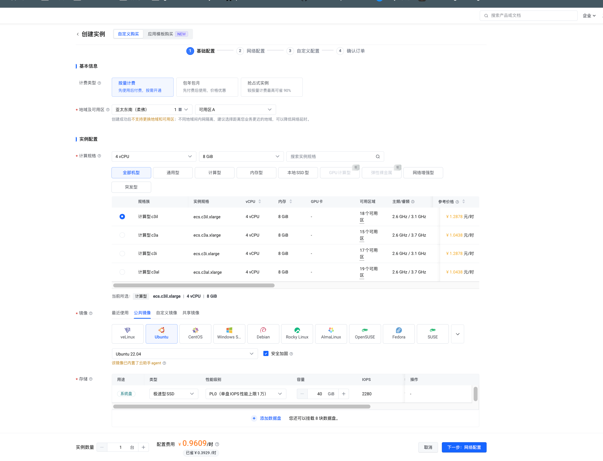
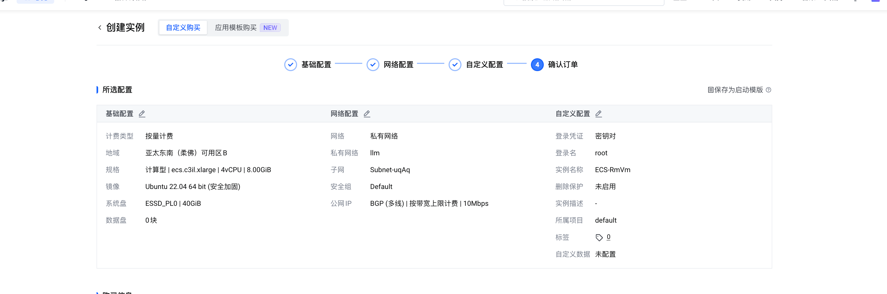
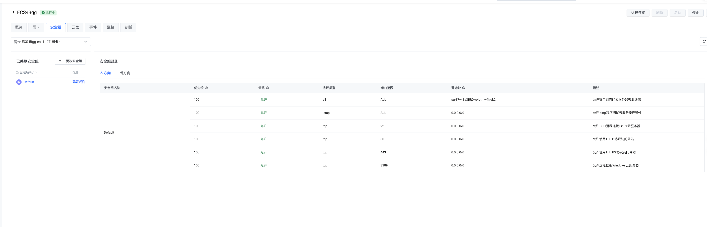
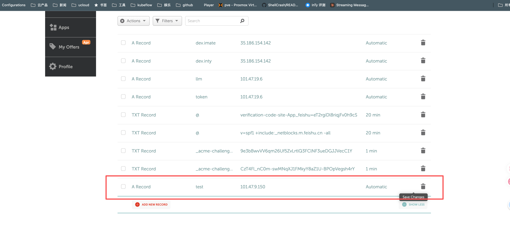
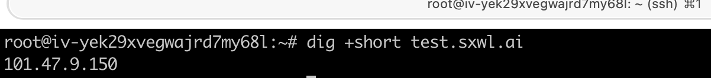
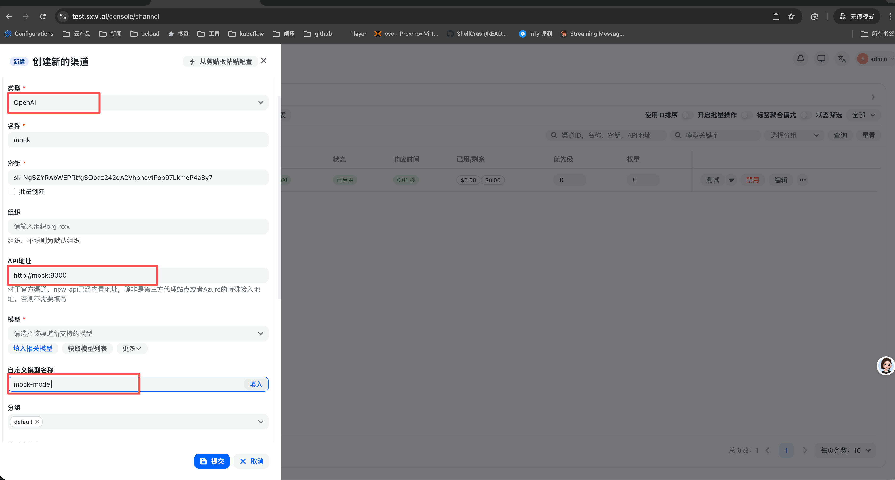
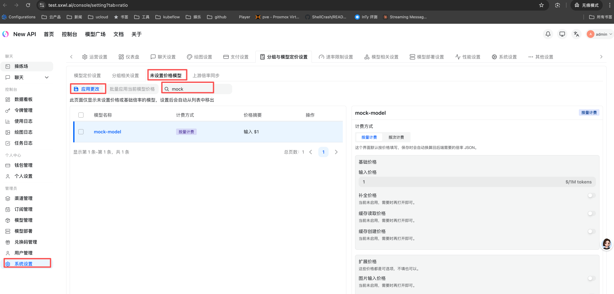
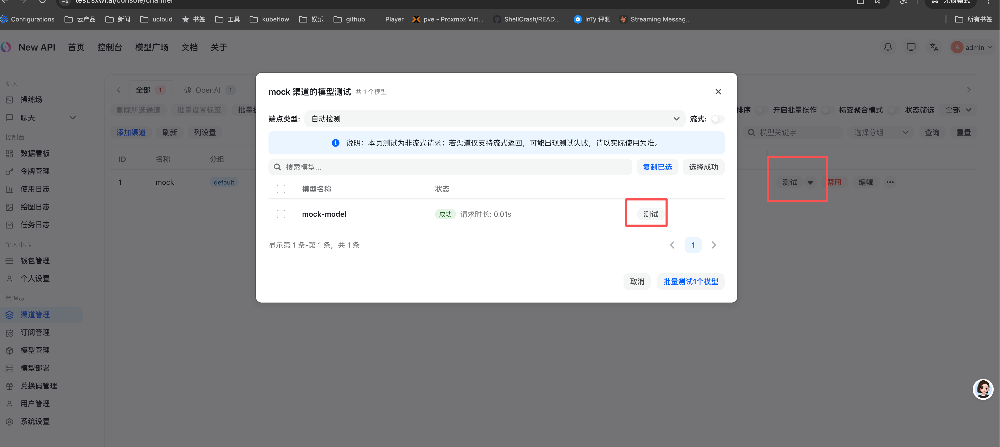
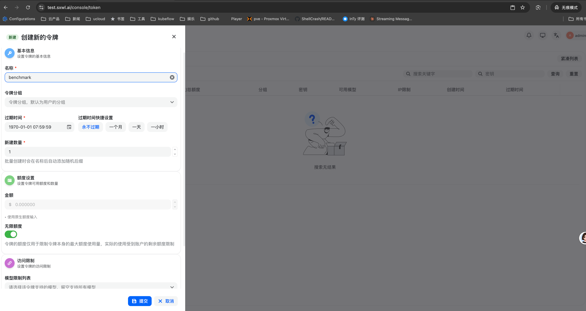

# 火山引擎单机（4c8g）NewAPI + Mock + Nginx + Locust 压测

本文档面向 **一台** 火山引擎 ECS（建议 **4 核 8G**，Ubuntu 22.04 或等价），在同一台机器上用 Docker Compose 运行：NewAPI（对齐[官方 docker-compose](https://github.com/QuantumNous/new-api/blob/main/docker-compose.yml)）+ PostgreSQL + Redis、**仅内网可达**的 Mock 上游、对外 **Nginx（Let’s Encrypt HTTPS）**，并在宿主机运行 Locust 采集指标。

---

## 架构与资源说明

| 组件               | 访问方式          | 说明                                                                   |
| ------------------ | ----------------- | ---------------------------------------------------------------------- |
| Nginx              | 公网 **80 / 443** | TLS 终结，反代 NewAPI；大 body / 长读超时已配置                        |
| NewAPI             | 仅容器网 **3000** | 不映射宿主机端口，避免误暴露                                           |
| Mock               | 仅容器网 **8000** | NewAPI 渠道填 `http://mock:8000`，公网不可达                           |
| PostgreSQL / Redis | 内网              | 与官方栈一致                                                           |
| Locust             | **宿主机**        | 建议 `NEWAPI_BASE_URL=https://你的域名`，走与真实用户一致的 HTTPS 路径 |

**4c8g 资源**：Compose 中为各服务设置了 `mem_limit` / `cpus`（可在 [volc-standalone/docker-compose.yml](volc-standalone/docker-compose.yml) 调整）。**Locust 与网关同机时**会争抢 CPU，结果更适合做「环境联调 / 回归」；若要测「纯网关容量」，请另起一台压测机，仅把 `NEWAPI_BASE_URL` 指向本机域名或 LB。

---

## 物料打包（在开发机执行）

在仓库内进入 `benchmark/` 目录：

```bash
cd benchmark
chmod +x volc-standalone/scripts/pack.sh
./volc-standalone/scripts/pack.sh
```

后续等将生成的 `volc-benchmark-*.tar.gz` 上传到机器上，例如：

```bash
scp volc-benchmark-20260415_110417.tar.gz root@{公网IP}:/root/
tar xzvf volc-benchmark-*.tar.gz
```

解压后应存在：`**VOLC_STANDALONE.md**`（本文档副本）、`mock/`、`locust/`、`volc-standalone/`（**保持相对位置**，否则 Mock 构建上下文会失效）。操作时可打开当前目录下的 `VOLC_STANDALONE.md`，或与仓库内文档同步更新。

---

## 火山引擎侧准备

1. **实例**：4c8g，绑定 **弹性公网 IP**。
   
   
   

2. **安全组**：入方向放行 **TCP 22、80、443**（80 用于 Let’s Encrypt HTTP-01）。
   
3. **Docker Engine 与 Compose 插件**：推荐使用 **Ubuntu 22.04 / 24.04** 等 deb 系镜像。下面为 **官方 apt 源** 安装方式（与 [Docker 官方 Ubuntu 文档](https://docs.docker.com/engine/install/ubuntu/) 一致）；若为其他发行版，请在 [Install Docker Engine](https://docs.docker.com/engine/install/) 中选择对应系统。

   **（1）卸载可能冲突的旧包（若从未装过 Docker 可跳过）**

   ```bash
   sudo apt-get update
   for pkg in docker.io docker-doc docker-compose docker-compose-v2 podman-docker containerd runc; do
     sudo apt-get -y remove "$pkg" 2>/dev/null || true
   done
   ```

   **（2）安装依赖并添加 Docker 官方 GPG 与 apt 源**

   ```bash
   sudo apt-get update
   sudo apt-get install -y ca-certificates curl
   sudo install -m 0755 -d /etc/apt/keyrings
   sudo curl -fsSL https://download.docker.com/linux/ubuntu/gpg -o /etc/apt/keyrings/docker.asc
   sudo chmod a+r /etc/apt/keyrings/docker.asc
   echo "deb [arch=$(dpkg --print-architecture) signed-by=/etc/apt/keyrings/docker.asc] https://download.docker.com/linux/ubuntu $(. /etc/os-release && echo "${VERSION_CODENAME:-$VERSION_ID}") stable" | sudo tee /etc/apt/sources.list.d/docker.list > /dev/null
   sudo apt-get update
   ```

   **（3）安装 Docker Engine、Buildx 与 Compose 插件**

   ```bash
   sudo apt-get install -y docker-ce docker-ce-cli containerd.io docker-buildx-plugin docker-compose-plugin
   sudo systemctl enable --now docker
   ```

   **（4）验证**

   ```bash
   docker --version
   docker compose version
   ```

   使用 **非 root** 账号时，将当前用户加入 `docker` 组后需 **重新登录 SSH 会话** 再执行无 `sudo` 的 `docker`：

   ```bash
   sudo usermod -aG docker "$USER"
   # 退出并重新登录，或: newgrp docker
   ```

4. **（可选）镜像加速**：拉取 `calciumion/new-api`、`postgres`、`redis`、`nginx` 较慢时，在 daemon 中配置 registry mirror（火山/云厂商文档或企业内网镜像）。

---

## Namecheap 域名解析

1. 登录 Namecheap → **Domain List** → **Manage** → **Advanced DNS**。
2. 新增 **A Record**：**Host** 填子域（如 `api`），**Value** 填 ECS **公网 IP**，TTL Automatic 即可。
   
3. 等待解析生效（通常数分钟～半小时）。签发证书前请确认：
   `dig +short test.sxwl.ai`（将域名换成你的 **完整 DOMAIN**）返回正确公网 IP。
   
   本文后续以 `test.sxwl.ai` 为占位符，实际与 `.env` 中 `DOMAIN` 一致。

---

## 部署步骤（目标约 30 分钟）

| 阶段 | 内容                                               | 参考耗时                |
| ---- | -------------------------------------------------- | ----------------------- |
| 1    | 解压物料、安装 Docker、放行安全组、解析域名        | 5–15 分钟（视网络）     |
| 2    | 配置 `.env`、生成初始 Nginx、拉镜像并 `compose up` | 5–15 分钟（视镜像拉取） |
| 3    | 签发 Let’s Encrypt、reload Nginx                   | 2–5 分钟                |
| 4    | NewAPI 后台：渠道 + 令牌（不可完全自动化）         | 约 5 分钟               |
| 5    | `curl` 验收、Locust 短跑、收 CSV/HTML              | 5 分钟                  |

### 1. 进入目录并初始化

```bash
cd volc-standalone
chmod +x deploy.sh scripts/*.sh
cp .env.example .env
# 编辑 .env：DOMAIN、LETSENCRYPT_EMAIL、POSTGRES_PASSWORD（务必修改默认密码）
./scripts/bootstrap.sh
```

`bootstrap.sh` 会创建 `data/`、`logs/`、`certbot/`、`nginx/active.conf`（**仅 HTTP**，含 ACME webroot，并反代 NewAPI）。

### 2. 启动全栈

```bash
./deploy.sh
# 等价于：若无 active.conf 则 bootstrap；然后 docker compose up -d --build
```

构建 **Mock** 需要同级的 `../mock` 目录（解压包已按此布局）。

查看状态：

```bash
docker compose ps
docker compose logs -f new-api
```

此时可用 **HTTP** 访问 `http://<DOMAIN>`（若解析已生效）打开 NewAPI 控制台（证书步骤前后均可用于登录配置，生产环境建议在 HTTPS 完成后再暴露业务）。

### 3. 签发 HTTPS 证书

确认 **80** 端口对公网可达且域名解析到本机：

```bash
./scripts/issue-cert.sh
```

脚本会：用 **webroot** 模式运行官方 `certbot/certbot` 镜像 → 将 `nginx/active.conf` 切换为 **HTTPS 模板** → `nginx -s reload`。

证书与密钥位于 `certbot/conf/live/<DOMAIN>/`（勿提交到 Git；打包脚本默认排除已签发的 `live/` 等目录）。

**续期**：见 `scripts/renew-note.sh`（打印 crontab 示例）。

### 4. NewAPI 后台配置（手工）

浏览器打开：`https://<DOMAIN>`，按提示完成初始化：


1. **渠道**：新增 **OpenAI 兼容**（或 Custom），**基础 URL** 填 `http://mock:8000`（不要加 `/v1`），API Key 可填占位（如 `mock`），模型名与压测一致，例如 `mock-model`，保存并启用。
   

   

   

2. **令牌**：新建 Token，复制 **API Key**（形如 `sk-...`），供 Locust 使用。
   
   说明：Compose 已为 `new-api` 设置 `FRONTEND_BASE_URL=https://${DOMAIN}`，便于管理端生成正确外链（与[官方环境变量说明](https://github.com/QuantumNous/new-api-docs/blob/main/docs/en/installation/docker-compose-yml.md)一致）。

### 5. 验证

**经域名调用网关（替换真实 Token）：**

```bash
export TOK=sk-你的令牌
curl -sS -X POST "https://$(grep '^DOMAIN=' .env | cut -d= -f2-)/v1/chat/completions" \
  -H "Authorization: Bearer $TOK" \
  -H "Content-Type: application/json" \
  -d '{"model":"mock-model","messages":[{"role":"user","content":"hi"}],"max_tokens":8}'
```

应返回含 `choices` 与 `usage` 的 JSON。

**（可选）在 new-api 容器内确认能访问 Mock：**

```bash
docker compose exec new-api wget -qO- http://mock:8000/health
```

---

## Locust 压测与指标

在 **宿主机** 安装依赖（需 Python ≥3.13，与仓库 [AGENTS.md](../AGENTS.md) 一致；或使用 `uv pip`）：

```bash
cd ../locust
pip install -r requirements.txt
```

环境变量（域名与令牌按实际修改）：

```bash
export NEWAPI_BASE_URL="https://$(grep '^DOMAIN=' ../volc-standalone/.env | cut -d= -f2-)"
export NEWAPI_API_KEY="sk-你的令牌"
export NEWAPI_MODEL="mock-model"
# 大 input/output case 需要足够超时，默认 300 秒
export LOCUST_REQUEST_TIMEOUT=300
```

无界面压测示例（50 用户、每秒启动 10、持续 300 秒，输出 CSV 与 HTML）：

```bash
locust -f locustfile.py --headless -u 50 -r 10 -t 300s \
  --host="$NEWAPI_BASE_URL" \
  --csv=report --html=report.html
```

压测结束后查看终端摘要（含 CSV 汇总；若本次运行生成了 `locust_last_token_metrics.json`，会附带 **RPM / TPM**）：

```bash
python3 summarize_run.py
# 或: python3 summarize_run.py report_stats.csv --failures
```

产物说明见 [locust/README.md](locust/README.md)。建议每轮使用不同前缀，例如 `--csv=run_$(date +%Y%m%d_%H%M%S)`。

---

## 验证检查清单

- 安全组已放行 22 / 80 / 443；公网 IP 绑定正确。
- Namecheap **A 记录** 指向该公网 IP，`dig` 解析正确。
- `docker compose ps` 中 `new-api`、`mock-openai`、`benchmark-nginx`、`postgres`、`redis` 均为 Up。
- `https://<DOMAIN>` 证书有效，管理端可登录。
- 渠道基础 URL 为 `http://mock:8000`，模型名与 Locust 一致。
- `curl` 调用 `POST /v1/chat/completions` 成功。
- Locust 运行结束；`report_*_stats.csv` 中有多条 `/v1/chat/completions in=… out=…`；失败率可接受。

---

## 常见问题

- **issue-cert 失败 / Connection refused**：检查 80 是否对公网开放、Nginx 是否运行、`DOMAIN` 是否已解析到本机且 **勿与已在其它环境使用的域名冲突**（否则校验可能打到错误站点）。
- **大量压测失败 / 超时**：对照 [OPERATIONS.md](OPERATIONS.md)「多 input/output token case」一节；已加大 Nginx `client_max_body_size` 与读写超时，若仍失败可调高 `LOCUST_REQUEST_TIMEOUT` 或略降并发 `-u`。
- **NewAPI 无法访问 Mock**：渠道 URL 必须是容器内主机名 `http://mock:8000`，不要用 `localhost` 或宿主机 IP。
- **compose 警告 `DOMAIN` 未设置**：启动前务必配置 `.env` 中 `DOMAIN`，否则 `FRONTEND_BASE_URL` 不正确。

---

## 目录索引

| 路径                                                                           | 说明                                      |
| ------------------------------------------------------------------------------ | ----------------------------------------- |
| [volc-standalone/docker-compose.yml](volc-standalone/docker-compose.yml)       | 合并栈（官方 NewAPI + DB + Mock + Nginx） |
| [volc-standalone/.env.example](volc-standalone/.env.example)                   | 环境变量模板                              |
| [volc-standalone/nginx/](volc-standalone/nginx/)                               | HTTP / HTTPS 配置模板                     |
| [volc-standalone/scripts/bootstrap.sh](volc-standalone/scripts/bootstrap.sh)   | 初始化目录与 HTTP 版 Nginx                |
| [volc-standalone/scripts/issue-cert.sh](volc-standalone/scripts/issue-cert.sh) | Let’s Encrypt 签发并切换 HTTPS            |
| [volc-standalone/scripts/pack.sh](volc-standalone/scripts/pack.sh)             | 生成上传用 tar.gz                         |
